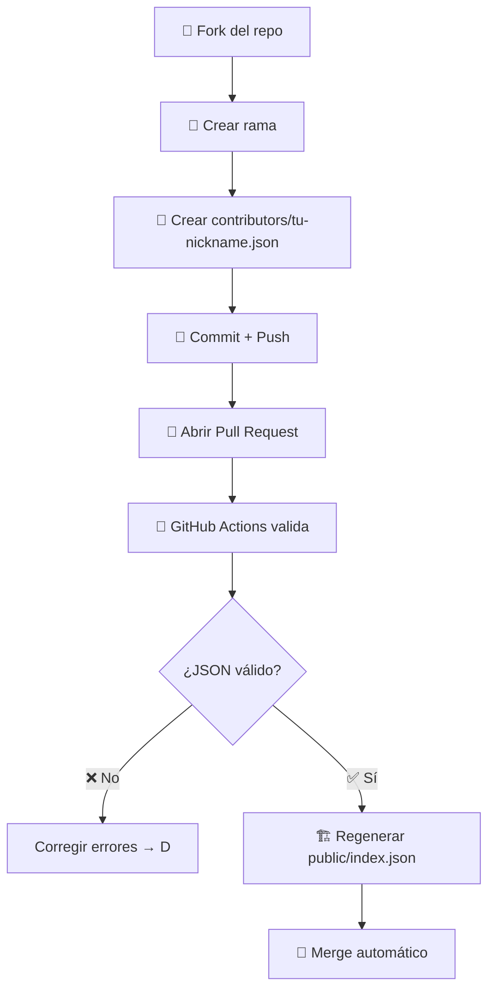

# IEEE CS UNAP — Workshop Git & GitHub

Proyecto colaborativo del taller de Git & GitHub de la IEEE Computer Society UNAP. Cada participante agrega su perfil mediante una Pull Request.

🌐 **[Ver la página web](https://dav082004.github.io/IEEE-CS-UNAP-Workshop/)**

---

## Flujo del repositorio

```
Fork → Rama → Crear tu JSON → Commit → Push → Pull Request → ✅ Auto-validación → 🎉 Merge
```



---

## Cómo contribuir

### 1. Preparar entorno

```bash
# Opción A: GitHub Codespace (recomendado — sin instalaciones)
# "Code" → "Codespaces" → "Create codespace on main"

# Opción B: Local
git clone https://github.com/TU-USUARIO/IEEE-CS-UNAP-Workshop.git
cd IEEE-CS-UNAP-Workshop
```

### 2. Crear tu rama

```bash
git checkout -b feat/add-tu-nickname
```

### 3. Crear tu archivo JSON

Crea `contributors/tu-nickname.json` con esta estructura:

```json
{
  "name": "Tu Nombre",
  "nickname": "tu-nickname",
  "github": "https://github.com/tu-usuario",
  "linkedin": "https://linkedin.com/in/tu-perfil",
  "instagram": "https://instagram.com/tu-usuario",
  "image": "https://github.com/tu-usuario.png",
  "description": "Descripción breve sobre ti",
  "hobbies": ["Hobby 1", "Hobby 2", "Hobby 3"]
}
```

> También puedes usar el formulario en la web para generar el JSON automáticamente.

### 4. Commit y Push

```bash
git add contributors/tu-nickname.json
git commit -m "feat: add profile for tu-nickname"
git push origin feat/add-tu-nickname
```

### 5. Crear Pull Request

Ve a GitHub → aparecerá el banner **"Compare & pull request"** → click → **"Create pull request"**.

---

## Automatización (GitHub Actions)

| Workflow | Cuándo | Qué hace |
|----------|--------|----------|
| **Validate PR** | Al abrir/actualizar la PR | Verifica que solo se modifique `contributors/` y que el JSON sea válido |
| **Generate Contributors** | Al hacer merge a `main` | Regenera `public/index.json` con todos los perfiles |

Si la validación falla, el bot deja un comentario en la PR con el error.

---

## Reglas

✅ **Solo debes tocar:** `contributors/tu-nickname.json`

❌ **No tocar:**
- `public/index.json` (auto-generado)
- Archivos de otros colaboradores
- HTML, CSS, JS del proyecto

---

## Agradecimientos

- **[IEEE Computer Society UNAP Student Branch](https://ieee.org/)** — organización del taller
- **[GitHub Education](https://education.github.com/)** — herramientas para el aprendizaje
